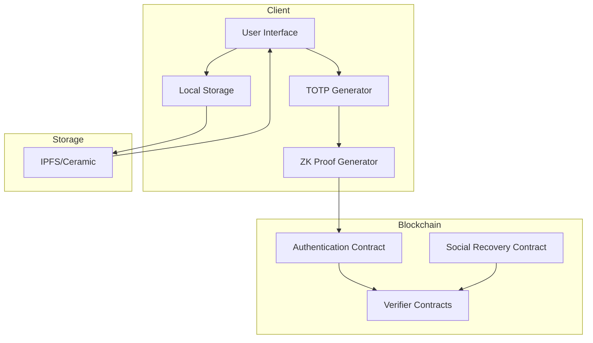
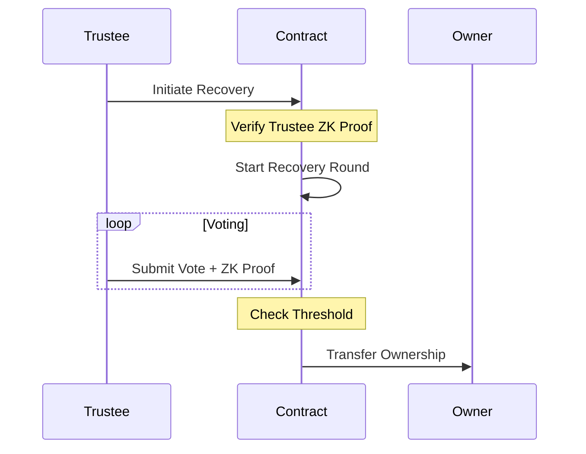

# ZK Authentication System Documentation

## Table of Contents
1. [Overview](#overview)
2. [System Architecture](#system-architecture)
3. [TOTP Authentication](#totp-authentication)
4. [Social Recovery](#social-recovery)
5. [Smart Contracts](#smart-contracts)
6. [Zero-Knowledge Circuits](#zero-knowledge-circuits)
7. [Security Considerations](#security-considerations)
8. [Implementation Guide](#implementation-guide)

## Overview

The ZK Authentication System is a blockchain-based two-factor authentication solution that combines Time-based One-Time Passwords (TOTP) with zero-knowledge proofs to provide secure, trustless authentication and account recovery capabilities.

### Key Features
- Zero-knowledge TOTP verification
- Smart contract-based authentication
- Trustless social recovery system
- Compatible with standard TOTP apps (e.g., Google Authenticator)
- Decentralized storage integration (IPFS/Ceramic)

## System Architecture



## TOTP Authentication

### Setup Process
1. **Secret Generation**
   - Random secret generated on client-side
   - Displayed as QR code for TOTP app scanning
   - Never stored on-chain or in centralized storage

2. **Merkle Tree Generation**
   ```mermaid
   graph TD
       A[Generate TOTP Secret] --> B[Generate 256 Time-Steps]
       B --> C[Hash Time+TOTP Pairs]
       C --> D[Build Merkle Tree]
       D --> E[Store Root On-Chain]
       D --> F[Store Tree in IPFS/Ceramic]
   ```

3. **Authentication Flow**
   - User initiates transaction
   - Gets current TOTP from authenticator app
   - Frontend generates ZK proof using:
     - Current TOTP
     - Current timestamp
     - Merkle path
   - Smart contract verifies proof
   - Transaction executes upon successful verification

### Circuit Implementation
```circom
template MerkleTreeInclusionVerification(n) {
    signal input time;
    signal input otp;
    signal input pathElements[n];
    signal input pathIndex[n];
    signal output root;
    // ... (circuit implementation details)
}
```

## Social Recovery

### Setup Process
1. **Trustee Configuration**
   - Owner designates trusted addresses
   - Sets recovery threshold
   - Assigns password hashes for each trustee

2. **Recovery Flow**


### Recovery States
1. **Initialization**
   - Trustee initiates with new owner proposal
   - ZK proof validates trustee's identity

2. **Voting**
   - Other trustees submit votes
   - Each vote requires ZK proof
   - Threshold tracking

3. **Execution**
   - Transfer ownership once threshold met
   - Clear recovery state

## Smart Contracts

### OtpValidator Contract
```solidity
contract OtpValidator {
    bytes32 constant ROOT_SLOT = 0xeb7c...;
    bytes32 constant VERIFIER_SLOT = 0x9be...;
    bytes32 constant LAST_VALIDATED_TIMESTAMP_SLOT = 0xcda...;
    
    function verifyOTP(
        uint256[2] memory a,
        uint256[2][2] memory b,
        uint256[2] memory c,
        uint256[2] memory input
    ) public returns (bool);
}
```

### ZkSocialRecoveryWallet Contract
Key features:
- Owner management
- Trustee management
- Recovery round tracking
- Vote counting
- Proof verification
- Transaction execution

## Zero-Knowledge Circuits

### TOTP Verification Circuit
```circom
template HashLeaves() {
    signal input leftLeaf;
    signal input rightLeaf;
    signal output out;
    // ... implementation
}

template MerkleTreeInclusionVerification(n) {
    // ... implementation
}
```

### Password Verification Circuit
```circom
template Main() {
    signal input pass;
    signal input addr;
    signal input hash;
    signal output out;
    // ... implementation
}
```

## Security Considerations

### TOTP Security
- One-time secret display
- No secret storage
- Time-based validity
- Proof uniqueness verification

### Recovery Security
- Threshold-based execution
- ZK proof requirement for all participants
- Password hash protection
- Prevention of replay attacks

### Smart Contract Security
- Assembly optimization
- Slot-based storage
- Reentrancy protection
- Access control

## Implementation Guide

### Client-Side Setup
1. Generate TOTP secret
2. Create and store Merkle tree
3. Deploy authentication contract
4. Configure trustees

### Authentication Flow
1. Get current TOTP
2. Generate ZK proof
3. Submit transaction with proof
4. Handle verification result

### Recovery Process
1. Trustee initiates recovery
2. Collect required votes
3. Submit proofs
4. Execute ownership transfer

### Storage Integration
1. IPFS/Ceramic configuration
2. Merkle tree storage
3. Recovery data management
4. Client-side caching